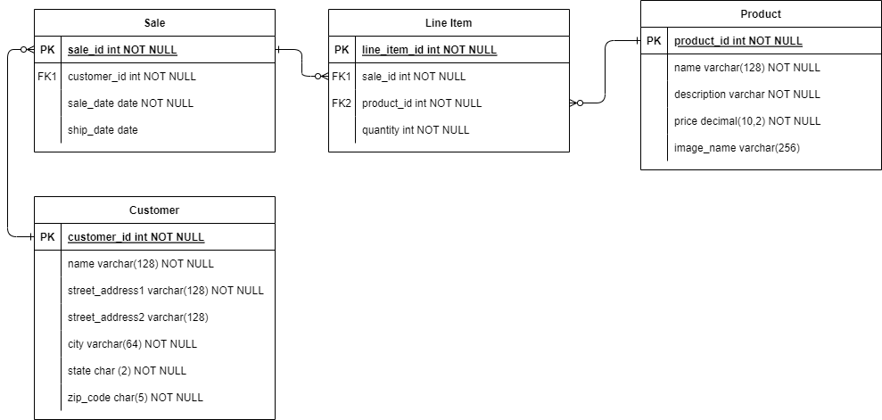

# Module two mid-module project

There are two options for this mid-module project:

1. Implement the **Solar System Geek application** described below in this document.
2. Create and implement your own **Custom application**.

The Solar System Geek application is a guided project with clear requirements describing the work you must do. However, since this application's design and instructions are part of the program curriculum, you can't host it publicly or use it directly in your software portfolio.

If you decide to create your own application, **you must confirm your application proposal with your instructor.**

## OPTION ONE - Solar System Geek application

This application allows employees in an e-commerce company to manage customer, product, and sales data. For example, users can view a list of products in the application and then choose to add, update, or delete the product data.

The [Requirements](#requirements) section later in this document describes more fully the application features.

## Database

Before running the application, create the `SSGeek` database. You must match the capitalization shown, or the application won't find the database.

After creating the database, run the `SSGeek.sql` script in the `database` folder to create and populate the database tables. Confirm that the tables exist by opening SSGeek -> Schemas -> Tables. After successfully running the script, you can find the `customer`, `line_item`, `product`, and `sale` tables inside.

Here is the Entity Relationship Diagram (ERD) of the database:

## Starting code

Once you have loaded the database, open the Module Two mid-module project in IntelliJ and review the starting code.

The project contains code defining the application's console user interface, including the required DAO interfaces and model classes. The code includes JavaDoc comments to explain the purpose of the various classes and methods.

Review the code provided, focusing on the following classes:

* `Application.java` - The *main* class of the application. Note the `TODO` comment indicating where to replace the `null` values.
* `CustomerDao.java` - The interface for accessing customer data, used by the application's "Customer admin" menu.
* `ProductDao.java` - The interface for accessing product data, used by the application's "Product admin" menu.
* `SaleDao.java` - The interface for accessing the sales data, used by the application's "Sales admin" menu.
* `LineItemDao.java` - The interface for accessing the sale line item details, used by the "Sales admin" menu.

## Requirements

Implement the DAO interfaces (`CustomerDao`, `ProductDao`, `SaleDao`, `LineItemDao`) and update the `Application` class to use them.

### Customer admin feature

The application must allow a user to:
* list all customers
* view customer details
* add a customer
* modify customer details

The `CustomerDao` interface provides methods to support these functions.

Create a `JdbcCustomerDao` class to implement this interface, writing tests to verify the methods behave correctly. Then create an instance of the DAO in the `Application` class to make the "Customer admin" menu options functional.

### Product admin feature

The application must allow a user to:
* list all products
* view product details
* add a product
* modify product details
* remove a product

The `ProductDao` interface provides methods to support these functions.

Create a `JdbcProductDao` class to implement this interface, writing tests to verify the methods behave correctly. Then create an instance of the DAO in the `Application` class to make the "Product admin" menu options functional.

### Sales admin feature

The application must allow a user to:
* list all sales orders for a customer
* list all sales orders for a product
* ship a sales order
* cancel (remove) a sales order

The `SaleDao` interface provides methods to support most of the sales admin features.

Create a `JdbcSaleDao` class to implement this interface, writing tests to verify the methods behave correctly. Then create an instance in the `Application` class to complete the "Sales admin" menu features.

The application must also allow a user to view the details of a sales order.

The `LineItemDao` interface provides methods to support viewing the details of a sales order.

Create a `JdbcLineItemDao` class to implement this interface, writing tests to verify the methods behave correctly. Then create an instance in the `Application` class. Now the application is fully complete.

## OPTION TWO - Custom application requirements

At a minimum, your application must meet the following minimum requirements:

* Have a clear purpose, function, or utility
* Incorporate at least three database tables (not including join tables needed to support Many-to-Many relationships)
  * Example 1: school, class, student
  * Example 2: hospital, doctor, patient
  * Example 3: user, artist, song
* Include a SQL script to create tables and any mock data
  * It's recommended (but not required) to create an ERD diagram describing the relationships between the tables
* Implement the DAO pattern for all tables in the database with:
  * An interface with abstract methods
  * A class that implements the interface and accesses the database
  * A class to model the data from the database
* Provide a user interface to allow users to:
  * Display data from the database
  * Add new data to the database
  * Update data in the database
  * Delete data from the database
* Include integration tests verifying the methods in all DAO implementation classes

### Datasets and mock data

Below are sites that contain free datasets you can use for your application:
* [https://kaggle.com/datasets](https://kaggle.com/datasets)
* [https://ieee-dataport.org](https://ieee-dataport.org)

Below is a site you can use to generate mock SQL data for your application:
* [https://www.mockaroo.com/](https://www.mockaroo.com/)

